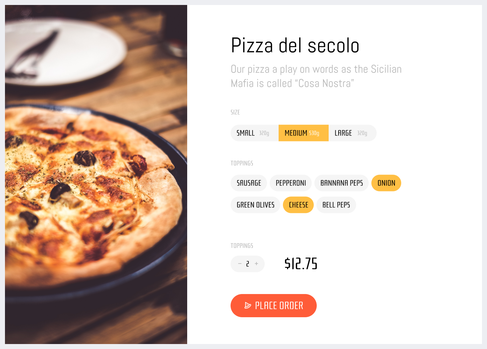

## Pizza Order Demo Application


🍭 Here you can find UI prototype: [figma](https://www.figma.com/file/Q1ZdtQ99iiRosAt92XntjEOf/%F0%9F%8D%95-Pizza-Order?node-id=0%3A1)

<br/>

## Getting started
Don't warry be magic 🧙‍

🧙‍ Three magic lines to get the project:
```sh
git clone git@github.com:sultan99/pizza-order.git
cd pizza-order
npm i
```
<br/>

🧙‍ Two magic commands to start:
```sh
npm run build
npm run server
```
<br/>

🔗 One magic link to get involved: [http://localhost:3000](http://localhost:3000/)
<br/>
<br/>

## Development enviroment
🧙‍ Two magic words to start:
```sh
npm start
```
<br/>

🔥 Hot reloads on every changes: [http://localhost:8080](http://localhost:8080/)
<br/>
